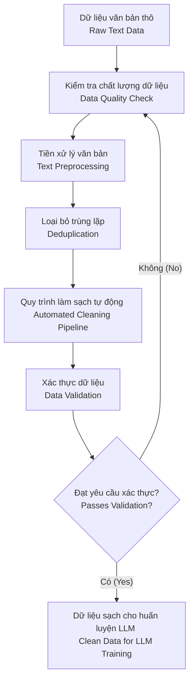

### Data cleaning pipeline



### Source code

#### Libs

```bash
pip install torch
pip install transformers
```

#### `calculate_perplexity` 

Hàm `calculate_perplexity` thực hiện tokenization (tách token) văn bản đầu vào thành các tensor PyTorch bằng tokenizer được cung cấp. Sau đó, nó chuyển đầu vào đã được token hóa vào mô hình, với `input_ids` cũng được sử dụng làm nhãn (labels), cho phép mô hình tính toán một giá trị loss (mất mát) đại diện cho lỗi dự đoán. Giá trị loss này được lũy thừa hóa (exponentiated) để suy ra điểm perplexity vô hướng (scalar perplexity score) và được trả về dưới dạng một số thực (float) của Python[cite: 286].

Phần thứ hai của đoạn mã khởi tạo một mô hình ngôn ngữ và tokenizer bằng cách sử dụng `GPT4LMHeadModel.from_pretrained("GPT4")` và `GPT4Tokenizer.from_pretrained("GPT4")`, các lệnh này sẽ tải trọng số của mô hình và tokenizer từ một nguồn đã được huấn luyện trước được xác định là "GPT4"

### Perplexity (Độ bối rối)

Perplexity là một thước đo được sử dụng để đánh giá các mô hình ngôn ngữ[cite: 288]. Nó định lượng mức độ một mô hình xác suất dự đoán tốt một mẫu dữ liệu[cite: 288].

Giá trị perplexity thấp hơn cho thấy mô hình tự tin hơn vào các dự đoán của mình và xem văn bản đó là có khả năng xảy ra cao hơn hoặc “bình thường” hơn[cite: 288]. Giá trị perplexity cao hơn cho thấy mô hình nhận thấy văn bản đó đáng ngạc nhiên hoặc bất thường hơn[cite: 288].

```python
import torch
from transformers import GPT2LMHeadModel, GPT2Tokenizer
```