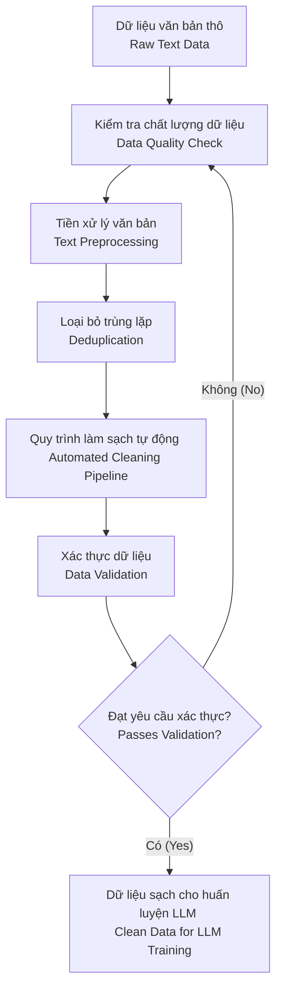

## Data cleaning pipeline

```mermaid
graph TD
    A[Dữ liệu văn bản thô <br>Raw Text Data] --> B[Kiểm tra chất lượng dữ liệu <br>Data Quality Check];
    B --> C[Tiền xử lý văn bản <br>Text Preprocessing];
    C --> D[Loại bỏ trùng lặp <br>Deduplication];
    D --> E[Quy trình làm sạch tự động <br>Automated Cleaning Pipeline];
    E --> F[Xác thực dữ liệu <br>Data Validation];
    F --> G{Đạt yêu cầu xác thực? <br>Passes Validation?};
    G -- Có (Yes) --> H[Dữ liệu sạch cho huấn luyện LLM <br>Clean Data for LLM Training];
    G -- Không (No) --> B;
```