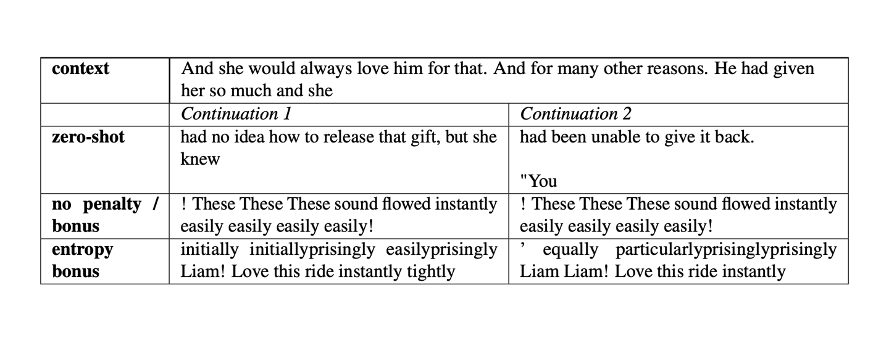

# Các câu hỏi thường gặp về Huấn luyện (Training FAQ)

## Tôi Nên Theo Dõi Những Chỉ Số (Metrics) Nào?

Khi thực hiện tinh chỉnh có giám sát (supervised fine-tuning) cổ điển cho các mô hình ngôn ngữ, `loss` (đặc biệt là `validation loss`) là một chỉ báo tốt về tiến trình huấn luyện. Tuy nhiên, trong Học tăng cường (Reinforcement Learning - RL), `loss` trở nên kém tin cậy hơn về hiệu suất của mô hình, và giá trị của nó có thể dao động trong khi hiệu suất thực tế lại đang được cải thiện.

Để giải quyết vấn đề này, chúng tôi khuyên bạn nên tập trung vào hai chỉ số chính sau đây trước tiên:

**Phần thưởng trung bình (Mean Reward)**: Mục tiêu chính là tối đa hóa phần thưởng mà mô hình đạt được trong quá trình huấn luyện RL.
**Độ phân kỳ KL Mục tiêu (Objective KL Divergence)**: Độ phân kỳ KL (Kullback-Leibler divergence) đo lường sự khác biệt giữa hai phân phối xác suất. Trong bối cảnh huấn luyện RL, chúng tôi sử dụng nó để định lượng sự khác biệt giữa mô hình hiện tại và một mô hình tham chiếu (reference model). Lý tưởng nhất, chúng tôi muốn giữ độ phân kỳ KL trong khoảng từ 0 đến 10 để đảm bảo văn bản do mô hình tạo ra vẫn gần giống với những gì mô hình tham chiếu tạo ra.

Tuy nhiên, còn nhiều chỉ số khác có thể hữu ích cho việc gỡ lỗi (debugging), hãy xem qua [phần ghi log (logging section)](https://www.google.com/search?q=logging).

## Tại Sao Chúng Ta Sử Dụng Mô Hình Tham Chiếu (Reference Model) và Mục Đích Của Độ Phân Kỳ KL (KL Divergence) Là Gì?

Khi huấn luyện các mô hình RL, việc tối ưu hóa chỉ dựa trên phần thưởng (reward) có thể dẫn đến những hành vi không mong muốn, nơi mô hình khai thác môi trường theo những cách không phù hợp với việc tạo ra ngôn ngữ tốt. Trong trường hợp của RLHF (Reinforcement Learning from Human Feedback), chúng tôi sử dụng một mô hình phần thưởng (reward model) được huấn luyện để dự đoán xem một văn bản được tạo ra có được con người xếp hạng cao hay không.

Tuy nhiên, mô hình RL được tối ưu hóa dựa trên mô hình phần thưởng có thể học được các mẫu (patterns) mang lại phần thưởng cao nhưng không đại diện cho ngôn ngữ tốt. Điều này có thể dẫn đến các trường hợp cực đoan, nơi mô hình tạo ra các văn bản có quá nhiều dấu chấm than hoặc biểu tượng cảm xúc để tối đa hóa phần thưởng. Trong một số trường hợp xấu nhất, mô hình có thể tạo ra các mẫu hoàn toàn không liên quan đến ngôn ngữ tự nhiên nhưng vẫn nhận được phần thưởng cao, tương tự như các cuộc tấn công đối nghịch (adversarial attacks).

<div style="text-align: center">

<p style="text-align: center;"> <b>Hình:</b> Các mẫu không có phạt KL (KL penalty) </p>
</div>

Để giải quyết vấn đề này, chúng tôi thêm một hình phạt (penalty) vào hàm phần thưởng dựa trên độ phân kỳ KL giữa mô hình hiện tại và mô hình tham chiếu. Bằng cách này, chúng tôi khuyến khích mô hình bám sát những gì mô hình tham chiếu tạo ra.

## Mối Quan Ngại Về Độ Phân Kỳ KL Âm (Negative KL Divergence) Là Gì?

Nếu bạn tạo văn bản bằng cách lấy mẫu hoàn toàn từ phân phối của mô hình (`model distribution`), mọi thứ nhìn chung sẽ hoạt động tốt. Nhưng khi bạn sử dụng phương thức `generate`, có một vài lưu ý vì nó không phải lúc nào cũng lấy mẫu hoàn toàn tùy thuộc vào các cài đặt, điều này có thể khiến độ phân kỳ KL trở thành số âm. Về cơ bản, khi mô hình đang hoạt động (active model) đạt được `log_p_token_active < log_p_token_ref`, chúng ta sẽ có KL-div âm. Điều này có thể xảy ra trong một số trường hợp:

  - **Lấy mẫu top-k (`top-k sampling`)**: mô hình có thể làm mịn phân phối xác suất, khiến các token `top-k` có xác suất nhỏ hơn so với mô hình tham chiếu nhưng chúng vẫn được chọn.
  - **`min_length`**: điều này bỏ qua token EOS cho đến khi đạt đến `min_length`. Do đó, mô hình có thể gán một `log prob` rất thấp cho token EOS và `prob` rất cao cho tất cả các token khác cho đến khi đạt đến `min_length`.

Đây chỉ là một vài ví dụ. Tại sao KL âm lại là một vấn đề? Tổng phần thưởng `R` được tính bằng `R = r - beta * KL`, vì vậy nếu mô hình có thể học cách điều khiển độ phân kỳ KL thành số âm, nó sẽ nhận được một phần thưởng dương một cách hiệu quả. Trong nhiều trường hợp, việc khai thác một lỗi như vậy trong quá trình sinh văn bản có thể dễ dàng hơn nhiều so với việc học hàm phần thưởng thực sự. Ngoài ra, KL có thể trở nên nhỏ tùy ý, do đó phần thưởng thực tế có thể rất nhỏ so với nó.

Vậy bạn nên tạo văn bản cho việc huấn luyện PPO như thế nào? Hãy cùng tìm hiểu\!

## Làm Thế Nào Để Tạo Văn Bản Cho Việc Huấn Luyện?

Để tránh các vấn đề về KL được mô tả ở trên, chúng tôi khuyên bạn nên sử dụng các cài đặt sau:

```python
generation_kwargs = {
    "min_length": -1, # không bỏ qua token EOS (xem ở trên)
    "top_k": 0.0, # không lấy mẫu top-k
    "top_p": 1.0, # không lấy mẫu nucleus
    "do_sample": True, # có, chúng tôi muốn lấy mẫu
    "pad_token_id": tokenizer.eos_token_id, # hầu hết các mô hình decoder không có token đệm (padding token) - hãy sử dụng token EOS thay thế
    "max_new_tokens": 32, # chỉ định số lượng token tối đa bạn muốn tạo
}
```

Với những cài đặt này, chúng tôi thường không gặp phải vấn đề gì. Bạn cũng có thể thử nghiệm với các cài đặt khác nhưng nếu bạn gặp vấn đề với độ phân kỳ KL âm, hãy thử quay lại những cài đặt này và xem chúng có còn tồn tại không.

## Làm Thế Nào Để Gỡ Lỗi (Debug) Cho Trường Hợp Sử Dụng Của Riêng Bạn?

Việc gỡ lỗi quy trình RL có thể là một thách thức do tính phức tạp của nó. Dưới đây là một số mẹo và đề xuất để làm cho quá trình này dễ dàng hơn:

  - **Bắt đầu từ một ví dụ hoạt động tốt**: Bắt đầu với một ví dụ đang hoạt động từ kho lưu trữ `trl` và dần dần sửa đổi nó để phù hợp với trường hợp sử dụng cụ thể của bạn. Thay đổi mọi thứ cùng một lúc có thể khiến việc xác định nguồn gốc của các vấn đề tiềm ẩn trở nên khó khăn. Ví dụ, bạn có thể bắt đầu bằng cách thay thế mô hình trong ví dụ và một khi bạn tìm ra các siêu tham số (`hyperparameters`) tốt nhất, hãy thử chuyển sang bộ dữ liệu và mô hình phần thưởng của bạn. Nếu bạn thay đổi mọi thứ cùng một lúc, bạn sẽ không biết vấn đề tiềm ẩn đến từ đâu.
  - **Bắt đầu nhỏ, mở rộng sau**: Huấn luyện các mô hình lớn có thể rất chậm và mất vài giờ hoặc vài ngày cho đến khi bạn thấy bất kỳ sự cải thiện nào. Đối với việc gỡ lỗi, đây không phải là một khoảng thời gian thuận tiện, vì vậy hãy thử sử dụng các biến thể mô hình nhỏ trong giai đoạn phát triển và mở rộng quy mô sau khi chúng hoạt động tốt. Tuy nhiên, đôi khi bạn phải cẩn thận vì các mô hình nhỏ có thể không đủ năng lực để giải quyết một nhiệm vụ phức tạp.
  - **Bắt đầu đơn giản**: Cố gắng bắt đầu với một ví dụ tối thiểu và xây dựng sự phức tạp từ đó. Trường hợp sử dụng của bạn có thể yêu cầu một hàm phần thưởng phức tạp bao gồm nhiều phần thưởng khác nhau - hãy thử sử dụng một tín hiệu trước và xem liệu bạn có thể tối ưu hóa nó hay không, sau đó thêm sự phức tạp vào sau.
  - **Kiểm tra các kết quả sinh ra (generations)**: Luôn là một ý kiến hay khi kiểm tra những gì mô hình đang tạo ra. Có thể có một lỗi trong quá trình xử lý hậu kỳ hoặc trong `prompt` của bạn. Do cài đặt không tốt, bạn có thể cắt ngắn các kết quả sinh ra quá sớm. Những điều này rất khó để thấy trên các chỉ số nhưng rất rõ ràng nếu bạn nhìn vào các kết quả sinh ra.
  - **Kiểm tra mô hình phần thưởng (reward model)**: Nếu phần thưởng của bạn không cải thiện theo thời gian, có thể có vấn đề với mô hình phần thưởng. Bạn có thể xem xét các trường hợp cực đoan để xem nó có hoạt động như mong đợi không: ví dụ, trong trường hợp phân tích tình cảm, bạn có thể kiểm tra xem các ví dụ tích cực và tiêu cực đơn giản có thực sự nhận được phần thưởng khác nhau không. Và bạn có thể xem xét sự phân phối của bộ dữ liệu của mình. Cuối cùng, có thể phần thưởng bị chi phối bởi `query` mà mô hình không thể ảnh hưởng, vì vậy bạn có thể cần phải chuẩn hóa điều này (ví dụ: phần thưởng của `query`+`response` trừ đi phần thưởng của `query`).

Đây chỉ là một vài mẹo mà chúng tôi thấy hữu ích - nếu bạn có thêm các thủ thuật hữu ích khác, vui lòng mở một PR để thêm chúng vào\!